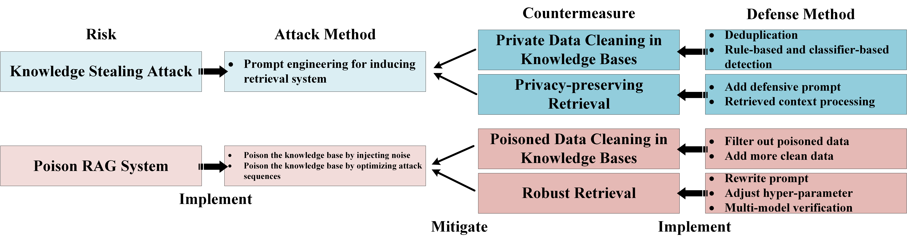

# Retrieval-Augmented Generation System

    

## Privcacy Risks
**Knowledge Stealing Attack** 
1. *[The Good and The Bad: Exploring Privacy Issues in Retrieval-Augmented Generation (RAG)](https://arxiv.org/abs/2402.16893)*
2. *[Privacy Implications of Retrieval-Based Language Models](https://arxiv.org/abs/2305.14888)*

## Security Risks
**Poison RAG** 
1. *[Typos that Broke the RAG's Back: Genetic Attack on RAG Pipeline by Simulating Documents in the Wild via Low-level Perturbations](https://arxiv.org/abs/2404.13948)*
2. *[Human-Imperceptible Retrieval Poisoning Attacks in LLM-Powered Applications](https://arxiv.org/abs/2404.17196)*
3. *[PoisonedRAG: Knowledge Poisoning Attacks to Retrieval-Augmented Generation of Large Language Models](https://arxiv.org/abs/2402.07867)*
4. *[TrojanRAG: Retrieval-Augmented Generation Can Be Backdoor Driver in Large Language Models](https://arxiv.org/abs/2405.13401)*
2. *[BadRAG: Identifying Vulnerabilities in Retrieval Augmented Generation of Large Language Models](https://arxiv.org/abs/2406.00083)*
3. *[Machine Against the RAG: Jamming Retrieval-Augmented Generation with Blocker Documents](https://arxiv.org/abs/2406.05870)*

## Countermeasure
**Privacy Protection**
* *A. External Knowledge Base:* Defenders can employ corpus cleaning to filter out private data from the knowledge base.
* *B. Retrieval Process:* Defenders can improve the retrieval process to protect privacy from knowledge stealing attacks.

**Security Defense**
* *A. External Knowledge Base:* Defenders can use corpus cleaning to filter poisoned data from the knowledge base.
* *B. Retrieval Process:* Defenders can improve the robustness of the retrieval process to be against poisoning RAG.
1. *[Certifiably Robust RAG against Retrieval Corruption](https://arxiv.org/abs/2405.15556)*
