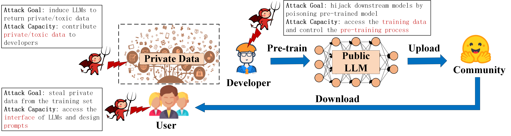
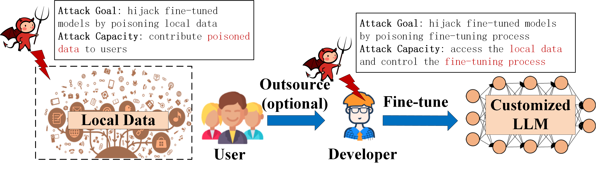
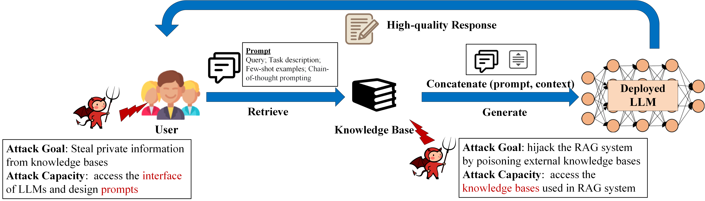
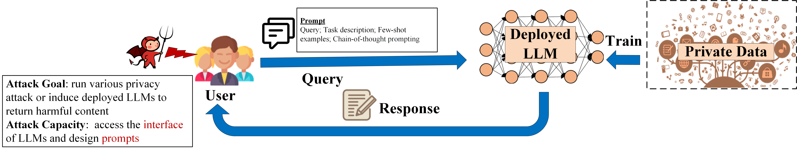
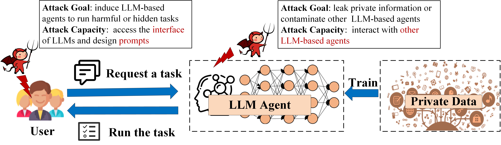

# Unique-Threats-for-LLMs

# The Life Cycle of LLM

## Pre-training LLMs
Model developers collect a large corpus as a pre-training dataset, including books, web pages, conversational texts, and code. They then use large-scale, Transformer-based networks and advanced training algorithms, enabling the models to learn rich language knowledge from vast amounts of unlabeled texts. After obtaining the pre-trained LLM, developers upload it to open-source community platforms to gain profits. We consider three malicious entities: contributors, developers, and users.

    

* [Privacy Risks](./Literature/pre_train.md)
* [Security Risks](./Literature/pre_train.md)
* [Countermeasure](./Literature/pre_train.md)

## Fine-tuning LLMs
Users customize LLMs for specific NLP tasks. They download pre-trained LLMs from open-source platforms and fine-tune them on customized datasets. There are three fine-tuning methods: supervised learning, instruction-tuning, and alignment-tuning. The first method is the commonly used training algorithm. For the second method, the instruction is in natural language format, containing a task description, an optional demonstration, and an input-output pair. Through a sequence-to-sequence loss, instruction-tuning helps LLMs understand and generalize to unseen tasks. The third method aligns LLMs' outputs with human preferences, such as usefulness, honesty, and harmlessness. Reinforcement learning from human feedback (RLHF) can meet these goals. We consider two malicious entities: contributors and third parties.

    

* [Security Risks](./Literature/fine_tune.md)
* [Countermeasure](./Literature/fine_tune.md)

## Retrieval-augmented generation (RAG) System
The RAG system is a unique method to enhance the performance of LLMs. This technology does not retrain LLMs and is orthogonal to pre-training and fine-tuning processes. The system constructs external knowledge bases. When given a prompt, the RAG system retrieves its context from the knowledge base and concatenates it, generating a high-quality response. We consider two malicious entities: contributors and users.

    

* [Privacy Risks](./Literature/rag.md)
* [Security Risks](./Literature/rag.md)
* [Countermeasure](./Literature/rag.md)
## Deploying LLMs
Model owners deploy well-trained LLMs to provide specialized services to users. Since LLMs can understand and follow natural language instructions, users can design specific prompts to achieve their goals. This is known as prompt engineering, exemplified by AUTOPROMPT, Prompt Tuning, and P-Tuning v2. Model owners provide user access interfaces to minimize privacy and security risks. Therefore, we consider a black-box attacker who aims to induce various risks through prompt design.

    

* [Privacy Risks](./Literature/deploy.md)
* [Security Risks](./Literature/deploy.md)
* [Countermeasure](./Literature/deploy.md)

## Deploying LLM-based Agents
LLM-based agents combine the robust semantic understanding and reasoning capabilities of LLMs with the advantages of agents in task execution and human-computer interaction, presenting significant potential. These agents can process various tasks and have become a focal point in research. Compared to LLMs, LLM-based agents are autonomous, allowing them to execute tasks independently rather than passively responding to prompts. Many privacy and security threats exist when deploying these agents. In this context, we consider two malicious entities: users and agents.

    

* [Privacy Risks](./Literature/agent.md)
* [Security Risks](./Literature/agent.md)
* [Countermeasure](./Literature/agent.md)
